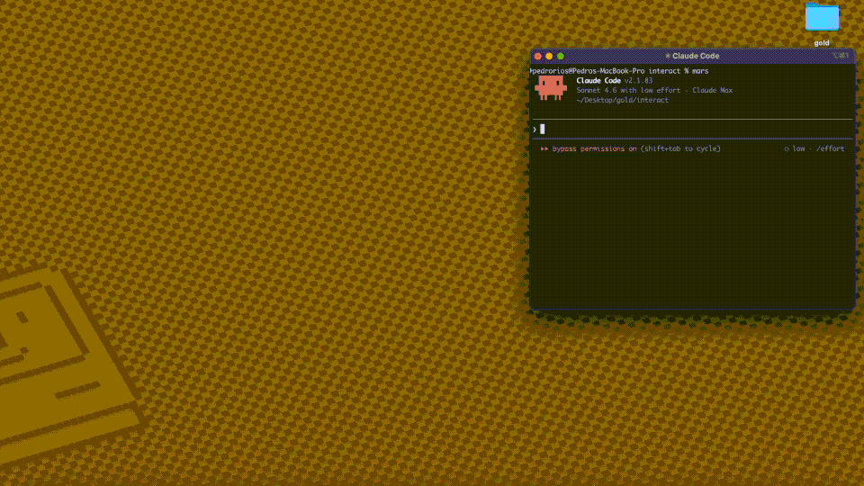

# pilot — AI agents in your real Chrome

[](https://www.npmjs.com/package/pilot-mcp)
[](https://github.com/TacosyHorchata/Pilot/blob/main/LICENSE)
[](https://github.com/TacosyHorchata/Pilot)

> Install a Chrome extension. Your AI agent gets a tab in the browser you're already using.



Every other browser tool launches a **new, anonymous browser**. Your agent starts logged out, gets blocked by Cloudflare, can't reach anything behind auth.

Pilot is a Chrome extension + MCP server. It connects your AI agent to **your real browser** — same sessions, same cookies, same logins. Your agent sees what you see.

```
You: "Summarize my GitHub notifications"

→ New tab opens in YOUR Chrome
→ Already logged into GitHub
→ Agent reads, summarizes, done
```

No headless browser. No cookie hacking. No re-authentication. No bot detection.

---

## How it works

```
AI Agent → MCP Server → WebSocket → Chrome Extension → Tab in your browser
         (stdio)       (localhost)
```

1. **Pilot runs as an MCP server** — Claude Code, Cursor, or any MCP client connects via stdio
2. **The Chrome extension connects** via WebSocket on localhost
3. **Your agent gets its own tab** in your real Chrome — all your sessions intact
4. **Multiple agents get separate tabs** — color-grouped so you can tell them apart

---

## Quick Start

### 1. Add the MCP server

```json
{
  "mcpServers": {
    "pilot": {
      "command": "npx",
      "args": ["-y", "pilot-mcp"]
    }
  }
}
```

### 2. Install the Chrome extension

```bash
npx pilot-mcp --install-extension
```

Opens Chrome's extensions page. Click **Load unpacked** → select the path shown in terminal.

### 3. Use it

> "Go to my GitHub notifications and summarize them"

A tab opens in your Chrome — already logged in as you.

---

## Lean snapshots

Other tools dump 50K+ chars per page into your context window. Pilot keeps things small:

```
Other tools:   navigate(58K) → navigate(58K) → answer        = 116K chars
Pilot:         navigate(2K)  → navigate(2K)  → snapshot(9K)  =  13K chars
```

`snapshot_diff` shows only what changed between actions — no redundant re-reads.

Less context = faster responses, cheaper API calls, fewer hallucinations.

---

## Pilot vs @playwright/mcp

| | Pilot | @playwright/mcp |
|---|---|---|
| **Browser** | Your real Chrome (extension) | New Chromium instance |
| **Auth state** | Already logged in everywhere | Anonymous — manual setup |
| **Bot detection** | Real fingerprint — not blocked | Blocked by Cloudflare |
| **Snapshot size** | ~2K navigate, ~9K full | ~50-60K |
| **Snapshot diff** | `pilot_snapshot_diff` | ❌ |
| **Cookie import** | Chrome, Arc, Brave, Edge, Comet | Manual JSON |
| **Iframes** | ✅ | ❌ |
| **Tool profiles** | `core` (9) / `standard` (30) / `full` (61) | `--caps` groups |
| **Transport** | stdio | stdio, HTTP, SSE |

---

## 61 tools across 3 profiles

Most LLMs degrade past ~30 tools. Load only what you need:

| Profile | Tools | What's included |
|---|---|---|
| `core` | 9 | navigate, snapshot, click, fill, type, press_key, wait, screenshot, snapshot_diff |
| `standard` | 30 | Core + tabs, scroll, hover, drag, iframes, forms, links, auth, block, find, element_state |
| `full` | 61 | Standard + network intercept, assertions, clipboard, geolocation, CDP, evaluate, PDF, responsive |

```json
{
  "mcpServers": {
    "pilot": {
      "command": "npx",
      "args": ["-y", "pilot-mcp"],
      "env": { "PILOT_PROFILE": "standard" }
    }
  }
}
```

Default: `standard`. [Full tool reference →](https://github.com/TacosyHorchata/Pilot/wiki/Tools)

---

## Headed fallback

When the extension isn't connected, Pilot opens a visible Chromium window automatically.

Import cookies from your real browser: `pilot_import_cookies({ browser: "chrome", domains: [".github.com"] })`

Supports **Chrome, Arc, Brave, Edge, Comet** via macOS Keychain / Linux libsecret. For CAPTCHAs: `pilot_handoff` → you intervene → `pilot_resume`.

Requires: `npx playwright install chromium`

---

## Requirements

- Node.js >= 18
- Chrome + Pilot extension (recommended)
- macOS or Linux
- Fallback only: `npx playwright install chromium`

## Security

- Extension communicates on **localhost only** (127.0.0.1)
- Output path validation prevents writes outside `PILOT_OUTPUT_DIR`
- Path traversal protection on all file operations
- `PILOT_PROFILE` controls which tools are exposed (`core` / `standard` / `full`)

---

## Credits

Core architecture — ref-based element selection, snapshot diffing, annotated screenshots — ported from **[gstack](https://github.com/garrytan/gstack)** by [Garry Tan](https://github.com/garrytan). Built on [Playwright](https://playwright.dev/) and the [MCP SDK](https://modelcontextprotocol.io/).

---

If Pilot is useful, [star the repo](https://github.com/TacosyHorchata/Pilot) — it helps others find it.

<!-- Keywords: MCP browser automation, Playwright MCP alternative, pilot-mcp, Claude Code browser, Cursor browser automation, MCP server, AI browser automation, web automation AI agent, browser automation for LLMs, cookie import MCP, Model Context Protocol browser, npx pilot-mcp, Chrome extension MCP, real browser AI agent, authenticated browser agent, Cloudflare bypass MCP -->
