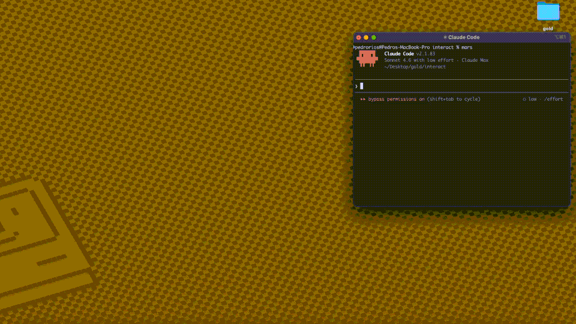

# pilot — browser automation MCP for AI agents

[](https://www.npmjs.com/package/pilot-mcp)
[](https://github.com/TacosyHorchata/Pilot/blob/main/LICENSE)
[](https://github.com/TacosyHorchata/Pilot)

> Native Playwright-backed browser sessions by default. No Chrome extension required for QA automation.



Pilot has two browser backends:

- **Native mode** (default): isolated Playwright browser contexts. This is the supported path for parallel QA automation and reliable screenshots.
- **Extension mode** (legacy/opt-in): connects to your real Chrome profile when you need existing cookies and logged-in sessions.

Native mode avoids `chrome.tabs.captureVisibleTab()` entirely, so screenshots do not depend on Chrome being foregrounded, a tab being visibly active, or the extension service worker being fresh.

---

## How it works

```
AI Agent → MCP Server → Broker on 127.0.0.1:3131 → Native browser session
         (stdio)       (first process owns broker)  (Playwright context/page)
```

1. **Pilot runs as an MCP server** — Claude Code, Cursor, or any MCP client connects via stdio
2. **The first Pilot process becomes the broker** on localhost
3. **Later Pilot processes connect as broker clients**
4. **Each session gets an isolated native browser context/page**
5. **Screenshots come from Playwright**, not the Chrome extension capture API

---

## Quick Start

### 1. Add the MCP server

```bash
codex mcp add pilot \
  --env PILOT_BROWSER_MODE=native \
  --env PILOT_PROFILE=full \
  -- npx -y pilot-mcp
```

For a local checkout:

```bash
npm install
npm run build
codex mcp add pilot \
  --env PILOT_BROWSER_MODE=native \
  --env PILOT_PROFILE=full \
  -- node /absolute/path/to/pilot/dist/index.js
```

### 2. Use it

> "Open https://example.com, take a screenshot, and summarize the page."

No extension install. No Chrome foreground requirement.

For full native-mode operations, stress commands, and cleanup checks, see [docs/native-mode.md](docs/native-mode.md).

---

## Lean snapshots

Other tools dump 50K+ chars per page into your context window. Pilot keeps things small:

```
Other tools:   navigate(58K) → navigate(58K) → answer        = 116K chars
Pilot:         navigate(2K)  → navigate(2K)  → snapshot(9K)  =  13K chars
```

`snapshot_diff` shows only what changed between actions — no redundant re-reads.

Less context = faster responses, cheaper API calls, fewer hallucinations.

---

## Pilot vs @playwright/mcp

| | Pilot | @playwright/mcp |
|---|---|---|
| **Browser** | Native Playwright context by default; real Chrome via legacy extension | New Chromium instance |
| **Auth state** | Native isolated by default; extension mode can use real Chrome cookies | Anonymous — manual setup |
| **Bot detection** | Native for automation; extension mode for real-profile handoff | Blocked by Cloudflare |
| **Snapshot size** | ~2K navigate, ~9K full | ~50-60K |
| **Snapshot diff** | `pilot_snapshot_diff` | ❌ |
| **Cookie import** | Chrome, Arc, Brave, Edge, Comet | Manual JSON |
| **Iframes** | ✅ | ❌ |
| **Tool profiles** | `core` (9) / `standard` (30) / `full` (61) | `--caps` groups |
| **Transport** | stdio | stdio, HTTP, SSE |

---

## 61 tools across 3 profiles

Most LLMs degrade past ~30 tools. Load only what you need:

| Profile | Tools | What's included |
|---|---|---|
| `core` | 9 | navigate, snapshot, click, fill, type, press_key, wait, screenshot, snapshot_diff |
| `standard` | 30 | Core + tabs, scroll, hover, drag, iframes, forms, links, auth, block, find, element_state |
| `full` | 61 | Standard + network intercept, assertions, clipboard, geolocation, CDP, evaluate, PDF, responsive |

```json
{
  "mcpServers": {
    "pilot": {
      "command": "npx",
      "args": ["-y", "pilot-mcp"],
      "env": { "PILOT_PROFILE": "standard" }
    }
  }
}
```

Default: `standard`. [Full tool reference →](https://github.com/TacosyHorchata/Pilot/wiki/Tools)

---

## Native mode

Native mode is the default:

```bash
PILOT_BROWSER_MODE=native
```

Use it for QA automation, parallel MCP sessions, and screenshot evidence.

Verify it before QA runs:

```bash
PILOT_HEADLESS=1 npm run stress:screenshots
npm run stress:codex
```

Expected: both report `6/6 passed`.

## Extension mode

Extension mode is legacy and opt-in:

```bash
PILOT_BROWSER_MODE=extension
```

Use it only when you need a user's already-authenticated real Chrome profile.

Import cookies from your real browser: `pilot_import_cookies({ browser: "chrome", domains: [".github.com"] })`

Supports **Chrome, Arc, Brave, Edge, Comet** via macOS Keychain / Linux libsecret. For CAPTCHAs: `pilot_handoff` → you intervene → `pilot_resume`.

---

## Requirements

- Node.js >= 18
- Playwright Chromium
- macOS or Linux
- Extension mode only: Chrome + Pilot extension

If Chromium is missing:

```bash
npx playwright install chromium
```

## Security

- Extension communicates on **localhost only** (127.0.0.1)
- Native broker communicates on **localhost only** (127.0.0.1)
- Native sessions use isolated browser contexts per MCP session
- Output path validation prevents writes outside `PILOT_OUTPUT_DIR`
- Path traversal protection on all file operations
- `PILOT_PROFILE` controls which tools are exposed (`core` / `standard` / `full`)

---

## Credits

Core architecture — ref-based element selection, snapshot diffing, annotated screenshots — ported from **[gstack](https://github.com/garrytan/gstack)** by [Garry Tan](https://github.com/garrytan). Built on [Playwright](https://playwright.dev/) and the [MCP SDK](https://modelcontextprotocol.io/).

---

If Pilot is useful, [star the repo](https://github.com/TacosyHorchata/Pilot) — it helps others find it.

<!-- Keywords: MCP browser automation, Playwright MCP alternative, pilot-mcp, Claude Code browser, Cursor browser automation, MCP server, AI browser automation, web automation AI agent, browser automation for LLMs, cookie import MCP, Model Context Protocol browser, npx pilot-mcp, Chrome extension MCP, real browser AI agent, authenticated browser agent, Cloudflare bypass MCP -->
